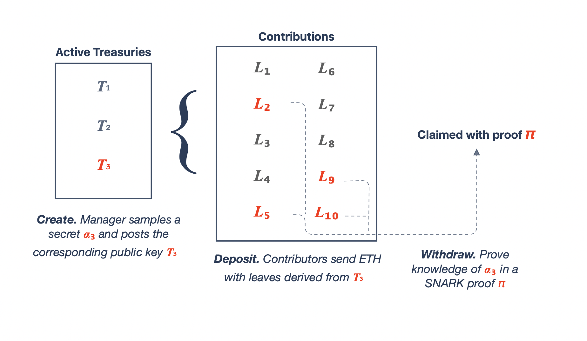
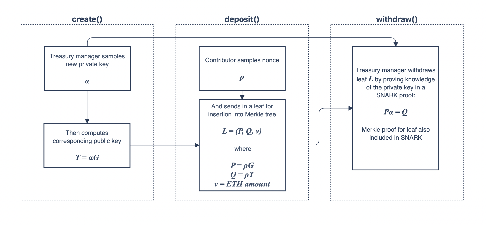

# Treasure House
A platform for DAOs with private treasuries. Based on [work done by Griffin Dunaif & Dan Boneh](https://hackmd.io/nCASdhqVQNWwMhpTmKpnKQ).

## Overview


Front-running is a consistent issue that many DAOs built on non-privacy enabled chains encounter in their day-to-day operations. One class of DAOs that are particularly impacted are collector DAOs that participate in sealed-bid auctions. Public verifiability of their treasuries puts them at a significant disadvantage, with the most prominent example being [ConstitutionDAO's loss in late 2021](https://decrypt.co/86491/constitutiondao-lost-auction-anti-bitcoin-citadel-ceo-ken-griffin). 

Balance hiding is a promising solution. The treasury implementation provided in this repository satisfies this property using a simple scheme based on [elliptic curve diffie-hellman key exchange](https://cryptobook.nakov.com/asymmetric-key-ciphers/ecdh-key-exchange). The core components of the scheme are as follows. 

One contract instance for this treasury is designed to support multiple DAOs to form an anonymity set. Rather than sending ETH to different contracts per treasury, contributors are meant to send ETH to this main contract, along with a cryptographic puzzle that only the DAO manager(s) know the solution to. The puzzle is a diffie-hellman shared key that's derived from the DAO manager's public key (not the same as their ethereum pubkey) and a nonce sampled by the contributor. Two important properties of this shared key are
1. Safety is protected by the [hardness of discrete-log](https://www.doc.ic.ac.uk/~mrh/330tutor/ch06s02.html#:~:text=The%20discrete%20logarithm%20problem%20is,logarithms%20depends%20on%20the%20groups.). Adversaries can't withdraw funds that don't belong to them.
1. Anonymity follows from the [decisional diffie-hellman assumption](https://crypto.stanford.edu/~dabo/pubs/papers/DDH.pdf). The shared key doesn't reveal anything about the target DAO public key. 
Thus, outside observers only know the total balance of all DAOs on the platform, but not how much each DAO is entitled to. 

Treasury managers check each deposit as it comes in to see whether their secret key can solve the attached puzzle. They can then redeem leaves posting a zkSNARK proof that verifies 1) knowledge of the secret and 2) inclusion of these leaves in the on-chain merkle tree. 

## Lifecycle of a Deposit

The above figure further specifies the puzzle attached to each leaf. 

## Implementation
1. The SNARK is built on the circom / snarkjs stack. We use the SNARK-friendly elliptic curve babyjubjub from [EIP-2494](https://eips.ethereum.org/EIPS/eip-2494). Our main circuit, `verif-manager.circom`, utilizes the IncrementalMerkleTree and Poseidon Hash implementations from [Semaphore](https://semaphore.appliedzkp.org/).
1. The contracts are meant for EVM deployment, so they are written in Solidity. They use the corresponding Solidity implementation of IncrementalMerkleTree from Semaphore. 
1. The CLI carries out babyjubjub keygen using [Onther-Tech's library](https://github.com/Onther-Tech/Babyjubjub-keygen) and proof generation using [snarkjs](https://github.com/iden3/snarkjs).

## Goerli Deployments
1. Main contract: `0x5dAb294C7698B8Bd1a3d90557223349Fe5B35BbD`
1. Groth16 verifier: `0xac71523A21Dd82C7645Edec341e90022aDF51F98`

## Getting Started on Local

### Set up `.env` file in `cli/`
Variable(s) that must be set at the beginning of the setup process: [`RPC_URL`]

### Generate the proving key, verifiying key, and witness generation instructions
Navigate into the `circuits/` directory, install the dependencies, and compile. 
```
cd circuits/
yarn
```
Compile the circuit. 
```
yarn dev
```
Run the test harness. 
```
yarn test
```

### Deploying the contracts
Navigate into the `contracts/` directory and install the dependencies
```
cd contracts/
yarn
```
Deploy the contracts that hold the poseidon hash functions. 
```
cd src/
ts-node deploy_poseidon.ts
```
Copy these addresses over to instantiate `hasherT3` and `hasherT6` in `src/PrivateTreasury.sol`. Now deploy the SNARK verifier. 
```
cd script/
bash forge_create_local_verifier.sh
```
Copy the verifier address over to `VERIFIER` var in `script/forge_create_local.sh`. Now deploy the main contract.
```
cd script/
bash forge_create_local_verifier.sh
```

### Running the CLI
Set these variables in your `.env` file: [`MANAGER_ETH_PRIVKEY`, `CONTRIBUTOR1_ETH_PRIVKEY`, `CONTRACT_ADDR`, `CONTRACT_ABI_PATH`]. Now you are ready to create a new treasury
```
ts-node create.ts
```
Use the outputs from this run to set these variables in your `.env` file: [`TREASURY_PRIVKEY`, `TREASURY_PUB_X`, `TREASURY_PUB_Y`]. Now deposit ETH into the treasury you just created.
```
ts-node deposit.ts
```
Withdraw ETH from the treasury.
```
ts-node withdraw.ts
```

## Future Roadmap
1. Switch to C++ witness generation for SNARK. 
1. Implement CLI functions as MetaMask Snaps.
1. Store frontier nodes for Merkle tree off-chain to make gas consumption for 
   deposits reasonable. 
1. Fork JuiceBox / Aragon & add private treasuries feature. 
1. [optional] Write a ledger VM to support proof generation. 
